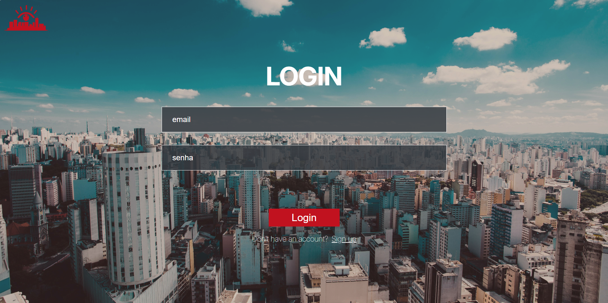

# FRONTEND De Olho no Meu Bairro

Aplicativo integrado (mobile + web + API) para registro e vizualização colaborativa de ocorrências no bairro com geolocalização, fotos e comentários em tempo real.

---

##  Sumário

- [Descrição](#descrição)
- [Tecnologias](#tecnologias)
- [Funcionalidades](#funcionalidades)

## Descrição

## Tecnologias

## Funcionalidades

- Autenticação (Login e Registro)

- Upload de fotos e geolocalização
